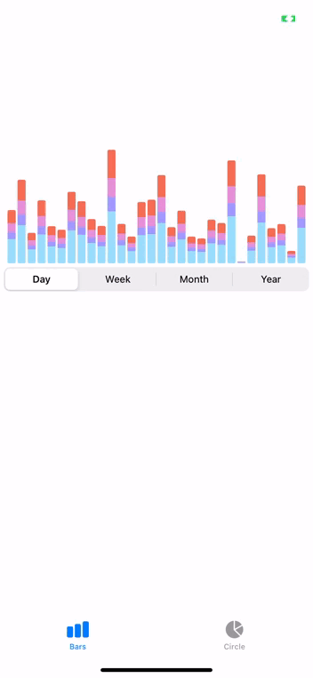

# Charts
In one of the projects I was working on, I had to create statistics module with different types of charts, I couldn't use any libraries and had to implement it myself. Later I decided to create this repo, so other developpers like me don't have to suffer that much :)
You free to copy it and use however you want.

**If you liked it, please, give me :star:, so I know, it was worth it.**

## What it looks like
 

&nbsp;&nbsp;&nbsp;&nbsp;&nbsp;

